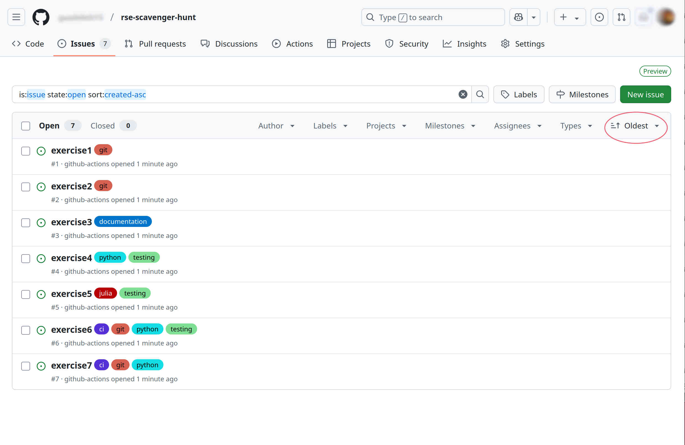
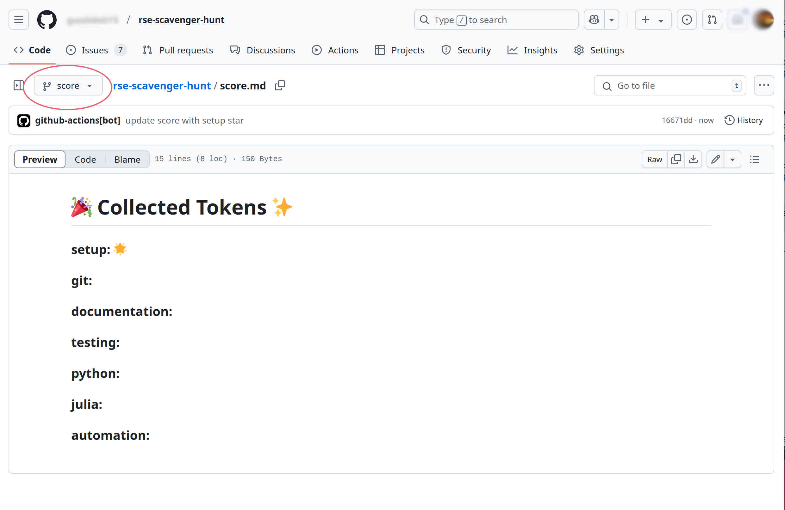

# How to start collecting tokens?

After setting up your fork, now you are ready to start collecting tokens.

## Exercises as issues 

You will see that now the repository has some issues, and if you sort them by oldest, you should see something like this.

Each issue contains an exercise, and by finishing each exercise, you will collect one or more tokens.

Note that the issues have labels depending on the skill that will be practiced. 

## Score board

Your repository also has now an additional `score` branch. The `score.md` file in this branch will be the place where your collected tokens, in this case stars, are being stored.

The first token is earned after the setup, and would look something like this

## Grading exercise

After doing an exercise, go to the corresponding issue and add the label `grade`. This is on the right side of the issue and you might need to scrolll to find it, check it. 

If the exercise is considered "correct", the issue will be closed and the `score.md` file in the `score` branch will be updated.

If the exercise is "not correct", a comment to the issue will appear asking you to take a look at your solution.  

The grading will take a few seconds.

If the solution needs to be re-graded, please remove the grade label and add it again when it is ready to be graded again.

  
 

