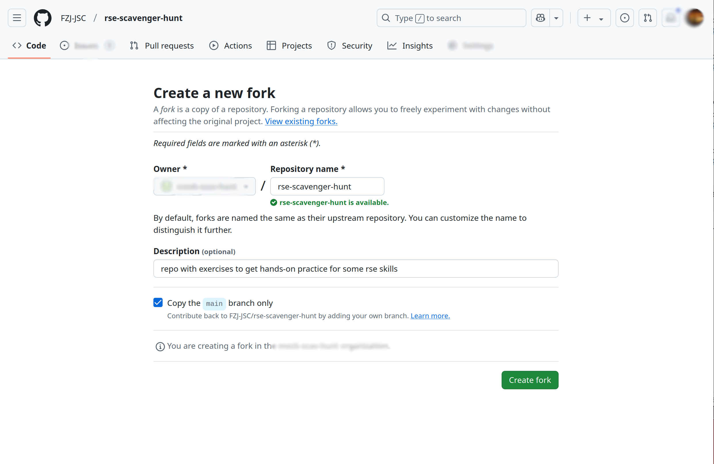
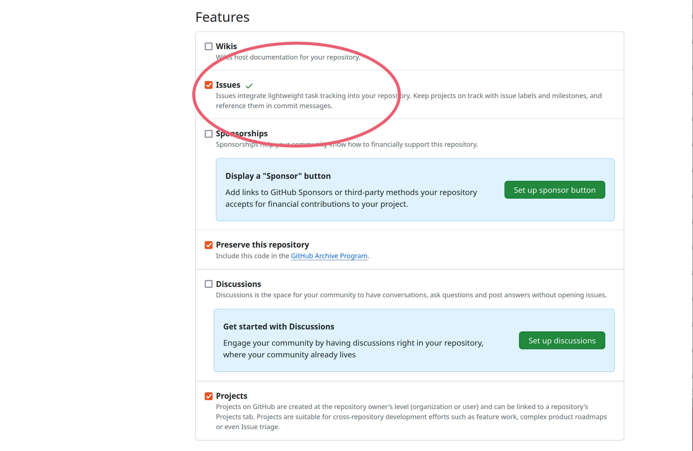
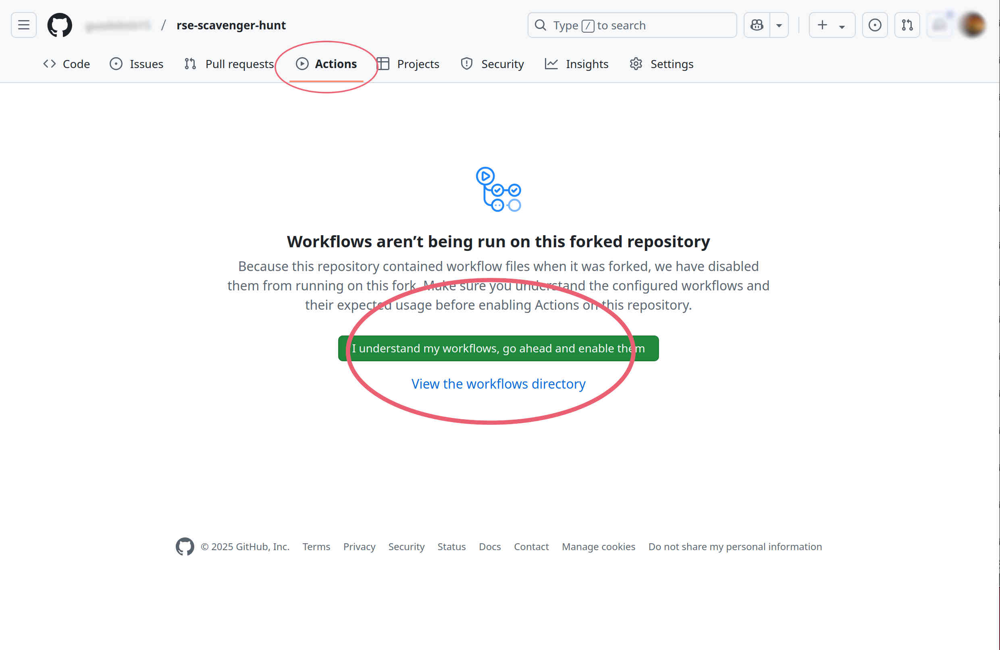
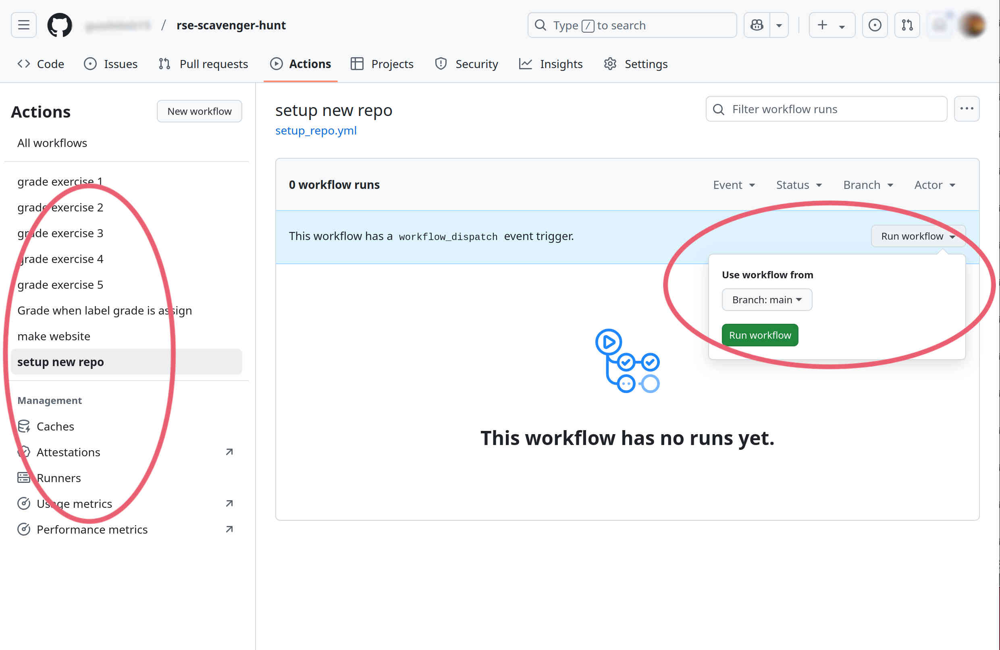
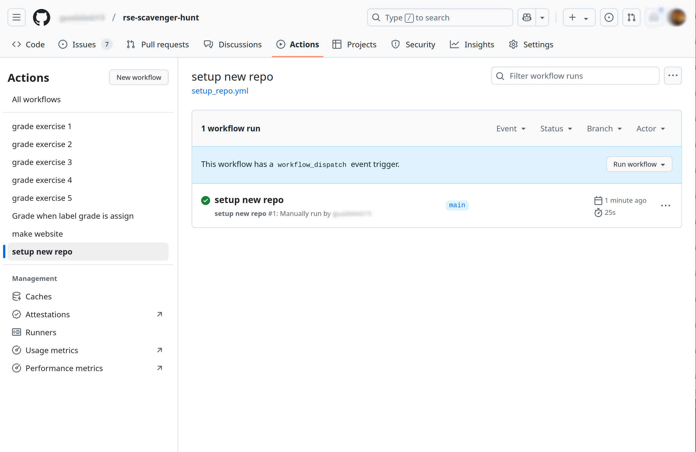

# Instructions to get started

Follow the next steps to get your repository set up

1. Fork [rse-scavenger-hunt](https://github.com/FZJ-JSC/rse-scavenger-hunt) by clicking **Fork** in the upper right section of the repository page 

2. You will be asked a couple of options for your fork. Keep the default options. Make sure you keep the check on `copy the main branch only` 

3. Once your fork is created, go to the **Settings** of your repository by clicking that option on the top right.

4. In the Settings page, you will need to enable **Issues** 

5. On the top part, now click **Actions**

6. GitHub will ask your permission to enable the workflows from the repository you forked. Enable the workflows, by clicking the green button option.  

7. Select on the left side, the `stup new repo` workflow. 

8. The middle part of the screen will show a blue banner with an option to `Run workflow`. Pick the main branch and press in the green button to Run workflow. 

9. If the setup went smoothly you should see something like the following 

 
